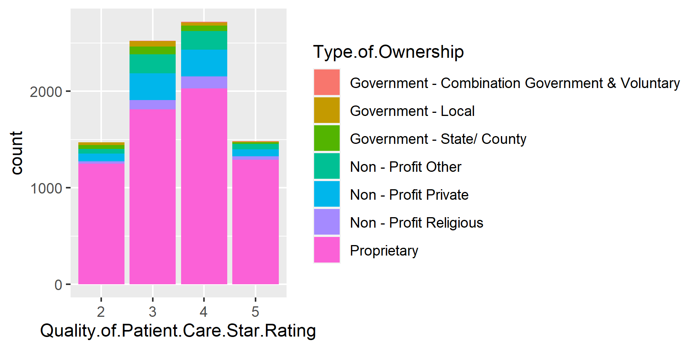
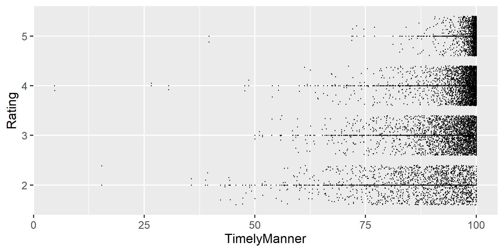
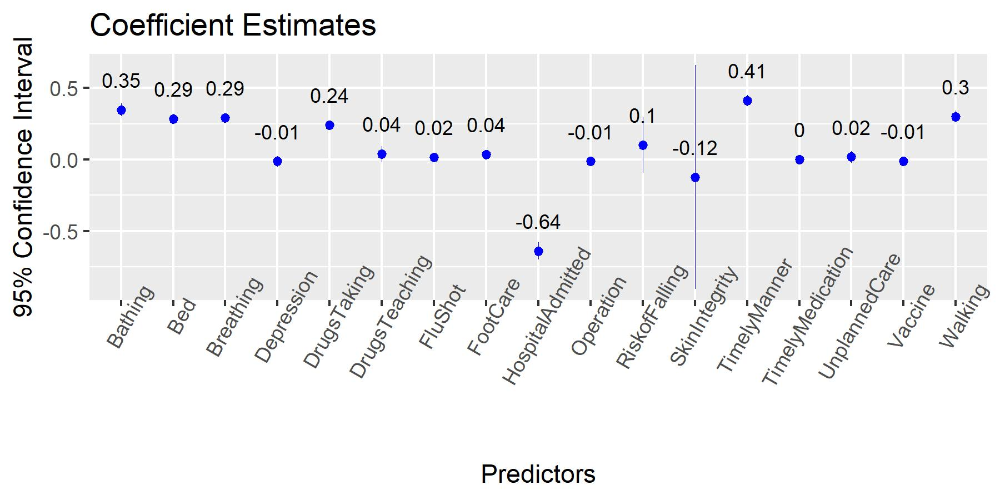
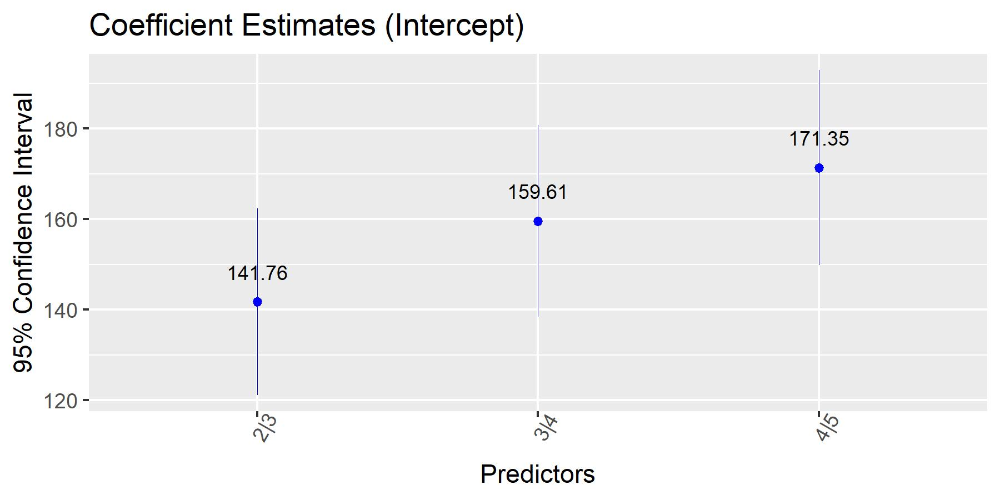
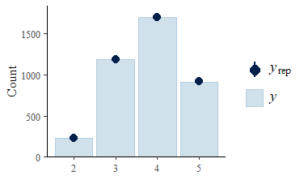

```{r setup, include=FALSE}
knitr::opts_chunk$set(echo = TRUE)
library(tidyverse)
library(drat)
library(ggplot2)
library(dplyr)
library(gridExtra)
library(magrittr)
library(viridis)
library(lubridate)
library(kableExtra)
library(ggpubr)
library(knitr)
library(tidyr)
```

# Introduction

This project is meant to implement data analysis on the United States Home Health Care Dataset. The motivation of this analysis is to help understanding what factors contributes to a better home health care in rating, and thus help getting knowledge on how we should improve home health care and what the future direction will be in this field. The dataset used in this report is downloaded from [Data.Medicare.Gov](Data.Medicare.Gov).

The dataset includes a number of variables that provides measurements of the quality of the home care services. Among the variables that are directly related to the home care service, there are 6 binary variables and 17 continuous variables. The binary varibales anwer those "Yes or No" questions: `Offers Nursing Care Services`, `Offers Physical Therapy Services`, `Offers Occupational Therapy Services`, `Offers Speech Pathology Services`, `Offers Medical Social Services`, `Offers Home Health Aide Services`. The continuous varibales mainly answer those "How often" questions, using the measure percentage as reported. For example, in the variable `How often the home health team began their patients' care in a timely manner`, the number indicates the percentage of the home health team having begun their patients' care in a timely manner.    

The outcome I am interested in is the `Quality of patient care star rating`. Although this variable is collected as a numeric rating from 1 through 5 in increments of 0.5, I treat it categorically with 9 possible outcomes. 

In this report, I am mainly concerned with how those continuous variables are correlated with the quality rating. My effort is put on building up a model for prediction. For convenience, the variables name in this report will be changed as in the Appendix A.
```{r, echo=FALSE,warning=FALSE}
#read cleaned dataset
care<-read.csv("care_cleaned.csv",header=TRUE)
#extract subset about quality rating
rating<-care[,c(2,9:34)]
colnames(rating)<-c("State","Type.of.Ownership","Offers.Nursing.Care.Services","Offers.Physical.Therapy.Services",                                                                                     "Offers.Occupational.Therapy.Services" ,                                                                   "Offers.Speech.Pathology.Services" ,                                                                        "Offers.Medical.Social.Services" ,                                                                          "Offers.Home.Health.Aide.Services",                                                                        "Date.Certified"            ,                                                                              "Quality.of.Patient.Care.Star.Rating", "TimelyManner","DrugsTeaching","RiskofFalling","Depression","FluShot","Vaccine","FootCare","Walking","Bed","Bathing","Breathing","Operation","DrugsTaking","HospitalAdmitted","UnplannedCare","SkinIntegrity","TimelyMedication")
rating$Type.of.Ownership%<>%factor()
rating$Quality.of.Patient.Care.Star.Rating%<>%ceiling()%<>%factor()
rating$Quality.of.Patient.Care.Star.Rating[which(rating$Quality.of.Patient.Care.Star.Rating==1)]<-2
rating$Quality.of.Patient.Care.Star.Rating%<>%factor()


```

# Method
## Exploratory Data Analysis

In this section, I will apply EDA on the dataset and get a sense of certain characteristics of the data. To simplify the the analysis, I will take ceiling of the `Quality of patient care star rating`. For example, 3.5 will be rounded up to 4. Without rounded up, the model fitting will also take too much time (longer than 48 hours using stan_polr).    
First, I want to get a sense of the distribution of the quality rating by type of ownership.

```{r,echo=FALSE,warning=FALSE}


```

Since the observations from the first category is much less than the other categories, the rating 1 and 2 are combined as one category, in order for a better model fitting.

```{r EDA1,echo=FALSE,warning=FALSE}

```

Plot for continuous variables against `Rating` is as follows:
```{r, echo=FALSE}

```

An example of  continuous variables versus `Quality of Patient Care Star Rating` are plotted above. The rest will be put in the Appendix B.   


## Modelling

### Ordinal Categorical Logistic Regression Model
Since I could not find an appropriate pacakage to fit a multilevel ordinal logistic model on this datset(`clmm()` from package `ordinal` does not work as well), in this section, I will fit an ordinal categorical logistic model on the dataset. The stan_plor() function will be used to build the model. To avoid wasting too much time on model fitting, I will randomly draw 4000 observations for fitting. The 95% confidence intervals of the coefficeint estimates are shown in the following plot:     

```{r Interval,echo=FALSE,warning=FALSE}


```

### Multilevel Ordinal Logistic Regression Mode
```{r, echo=FALSE}
rown<-sample(rownames(rating),2000)
fitset<-rating[rown,]
colnames(fitset)[10]<-"Rating"

m3<-clmm2(Rating~TimelyManner+DrugsTeaching+RiskofFalling+Depression+FluShot+Vaccine+FootCare+Walking+Bed+Bathing+Breathing+Operation+DrugsTaking+HospitalAdmitted+UnplannedCare+SkinIntegrity+TimelyMedication,random=Type.of.Ownership,data=fitset,Hess=T)
```


## Validation

```{r,echo=FALSE,warning=FALSE}

```

In the ppc bar plot, the darker blue dots indicate the medians of `yrep`, and the intervals indicates the uncertainty intervals. From the posterior predictive check, the plot clearly tells us that the model fits quite Ill.

# Result

From the EDA part, there are two points to stress on. First, the barplot shows that counts of rating on both ends are less than the middle ones, which accords with common sense. Second, in the scatter point plot, for variables `RiskofFalling`, `DrugsTeaching`, `RiskofFalling`, `Depression`, `FootCare`, the points concentrate on the right side, indicating these services are usually provided with a large percentage. Variables `FluShot` and `Vaccine`, while also show a tendency on a large percentage of service, they also have a larger dispersion towards left. In addition, the dots also have a tendency of concentrating on the upper-right, indicating that there should be some positive correlation betIen the variables and the ratings.         
Moreover, `Walking`, `Bed`, `Bathing`, `Breathing`, `Operation`, `DrugsTaking` are showing a more obvious positive correlation. The `HospitalAdmitted` and `SkinIntegrity` show negative correlations, which is consistent with what the variables represent.

From the coefficent plot, some useful information can be extracted. First, the `SkinIntegrity` have a large standard error, indicating that there is a large uncertainty in the estimate. Several coefficients, such as `Depression`, `Flushot`,`Vaccine`,`Operation`,`UnplannedCare`,`SkinIntegrity`,`TimelyMedication`, `RiskofFalling` have 95% confidence interval crossing 0, indicating that we can not safely reject that these coefficients should be 0. The result is also consistent with what I found in the EDA, where under these predictors, the `Rating` doesn't show a noticable positive or negative correlation.    
On the other hand, `Bathing`, `Bed`, `Breathing`, `DrugsTaking`, `TimelyManner` and `Walking` show significant estimates, and they are relatively high, indicating these variables are showing stronger positive correlation with the outcome variable. The `HospitalAdmitted`, on the opposite, shows a strong negative correlation with the outcome variable.
From the validation part, I use ppc bar plot to show how Ill the model fits. From the plot, the medians of predictive values `yrep` are basically the same as the counting of observative values `y`, indicating the model fitting good on the datset

# Discussion

The results drawn above shows that, for some variables, they might not have siginificant impacts on the `Rating`, such as `Depression` and all those insignificant variables in 5% level shown in the results. For those significant ones, there are two groups of them. First, for those having low estimates, they are showing a positive correlation with `Rating`, but they contribute small to the increase on the `Rating`. Meanwhile, for those having high estimates, the model predicts a larger increase on `Rating` when they are increasing. Therefore, the team should expect a higher `Rating` from the patient, by improving home health care services as follows:   
Help patients get better at bathing (`Bathing`);    
Help patients get in and out of bed (`Bed`);    
Help patients get better at breathing (`Breathing`);    
Help patients get better at taking their drugs correctly by mouth (`DrugsTaking`);     
Begin patient's care in a timely manner (`TimelyManner`);    
Help pateints get better at walking or moving around (`Walking`).    
Also, if the home health team successfully reduce the number of having the patients admitting to the hospital (`HospitalAdmitted`), they should expect a decent increase on the `Rating` as well.
Furthermore, I want to stress that 


### Appendix A

`Rating`: Quality of patient care star rating, a numeric rating from 1 through 5, in increments of 0.5. Factored in this report.

`TimelyManner` : How often the home health team began their patients' care in a timely manner.

`DrugsTeaching`: How often the home health team taught patients (or their family caregivers) about their drugs

`RiskofFalling`: How often the home health team checked patients' risk of falling

`Depression`: How often the home health team checked patients for depression

`FluShot`: How often the home health team determined whether patients received a flu shot for the current flu season

`Vaccine`: How often the home health team made sure that their patients have received a pneumococcal vaccine (pneumonia shot)

`FootCare`: With diabetes, how often the home health team got doctor's orders, gave foot care, and taught patients about foot care

`Walking`: How often patients got better at walking or moving around

`Bed`: How often patients got better at getting in and out of bed

`Bathing`: How often patients got better at bathing

`Breathing`: How often patients' breathing improved

`Operation`: How often patients' wounds improved or healed after an operation

`DrugsTaking`: How often patients got better at taking their drugs correctly by mouth

`HospitalAdmitted`: How often home health patients had to be admitted to the hospital

`UnplannedCare`: How often patients receiving home health care needed urgent, unplanned care in the ER without being admitted

`SkinIntegrity`: Changes in skin integrity post-acute care: pressure ulcer/injury

`TimelyMedication`: How often physician-recommended actions to address medication issues Ire completely timely


### Appendix B: EDA Plots
```{r,echo=FALSE,warning=FALSE}
#read cleaned dataset
care<-read.csv("care_cleaned.csv",header=TRUE)
#extract subset about quality rating
rating<-care[,c(2,9:34)]
colnames(rating)<-c("State","Type.of.Ownership","Offers.Nursing.Care.Services","Offers.Physical.Therapy.Services",                                                                                     "Offers.Occupational.Therapy.Services" ,                                                                   "Offers.Speech.Pathology.Services" ,                                                                        "Offers.Medical.Social.Services" ,                                                                          "Offers.Home.Health.Aide.Services",                                                                        "Date.Certified"            ,                                                                              "Quality.of.Patient.Care.Star.Rating", "TimelyManner","DrugsTeaching","RiskofFalling","Depression","FluShot","Vaccine","FootCare","Walking","Bed","Bathing","Breathing","Operation","DrugsTaking","HospitalAdmitted","UnplannedCare","SkinIntegrity","TimelyMedication")
rating$Type.of.Ownership%<>%factor()
rating$Quality.of.Patient.Care.Star.Rating%<>%ceiling()%<>%factor()

rating$Quality.of.Patient.Care.Star.Rating[which(rating$Quality.of.Patient.Care.Star.Rating==1)]<-2
rating$Quality.of.Patient.Care.Star.Rating%<>%factor()
```
```{r EDA2,echo=FALSE,warning=FALSE}
pp1<-ggplot(data=rating,aes(x=TimelyManner,y=Quality.of.Patient.Care.Star.Rating))+geom_point(size=0.01)+geom_jitter(size=0.01)+ylab("Rating")
pp2<-ggplot(data=rating,aes(x=DrugsTeaching,y=Quality.of.Patient.Care.Star.Rating))+geom_point(size=0.01)+geom_jitter(size=0.01)+ylab("Rating")
pp3<-ggplot(data=rating,aes(x=RiskofFalling,y=Quality.of.Patient.Care.Star.Rating))+geom_point(size=0.01)+geom_jitter(size=0.01)+ylab("Rating")

pp4<-ggplot(data=rating,aes(x=Depression,y=Quality.of.Patient.Care.Star.Rating))+geom_point(size=0.01)+geom_jitter(size=0.01)+ylab("Rating")

pp5<-ggplot(data=rating,aes(x=FluShot,y=Quality.of.Patient.Care.Star.Rating))+geom_point(size=0.01)+geom_jitter(size=0.01)+ylab("Rating")

pp6<-ggplot(data=rating,aes(x=Vaccine,y=Quality.of.Patient.Care.Star.Rating))+geom_point(size=0.01)+geom_jitter(size=0.01)+ylab("Rating")

pp7<-ggplot(data=rating,aes(x=FootCare,y=Quality.of.Patient.Care.Star.Rating))+geom_point(size=0.01)+geom_jitter(size=0.01)+ylab("Rating")

pp8<-ggplot(data=rating,aes(x=Walking,y=Quality.of.Patient.Care.Star.Rating))+geom_point(size=0.01)+geom_jitter(size=0.01)+ylab("Rating")
pp9<-ggplot(data=rating,aes(x=Bed,y=Quality.of.Patient.Care.Star.Rating))+geom_point(size=0.01)+geom_jitter(size=0.01)+ylab("Rating")
pp10<-ggplot(data=rating,aes(x=Bathing,y=Quality.of.Patient.Care.Star.Rating))+geom_point(size=0.01)+geom_jitter(size=0.01)+ylab("Rating")
pp11<-ggplot(data=rating,aes(x=Breathing,y=Quality.of.Patient.Care.Star.Rating))+geom_point(size=0.01)+geom_jitter(size=0.01)+ylab("Rating")

pp12<-ggplot(data=rating,aes(x=Operation,y=Quality.of.Patient.Care.Star.Rating))+geom_point(size=0.01)+geom_jitter(size=0.01)+ylab("Rating")


pp13<-ggplot(data=rating,aes(x=DrugsTaking,y=Quality.of.Patient.Care.Star.Rating))+geom_point(size=0.01)+geom_jitter(size=0.01)+ylab("Rating")
pp14<-ggplot(data=rating,aes(x=HospitalAdmitted,y=Quality.of.Patient.Care.Star.Rating))+geom_point(size=0.01)+geom_jitter(size=0.01)+ylab("Rating")

pp15<-ggplot(data=rating,aes(x=UnplannedCare,y=Quality.of.Patient.Care.Star.Rating))+geom_point(size=0.01)+geom_jitter(size=0.01)+ylab("Rating")

pp16<-ggplot(data=rating,aes(x=SkinIntegrity,y=Quality.of.Patient.Care.Star.Rating))+geom_point(size=0.01)+geom_jitter(size=0.01)+ylab("Rating")
pp17<-ggplot(data=rating,aes(x=TimelyMedication,y=Quality.of.Patient.Care.Star.Rating))+geom_point(size=0.01)+geom_jitter(size=0.01)+ylab("Rating")

ggarrange(pp1,pp2,pp3,pp4,ncol=2,nrow=2,labels="plot1")
ggarrange(pp5,pp6,pp7,pp8,labels="plot2")
ggarrange(pp9,pp10,pp11,pp12,labels="plot3")
ggarrange(pp13,pp14,pp15,pp16,labels="plot4")

ggarrange(pp17,col=1,"plot5")

```


